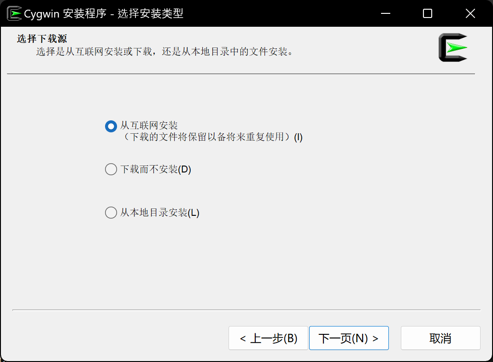
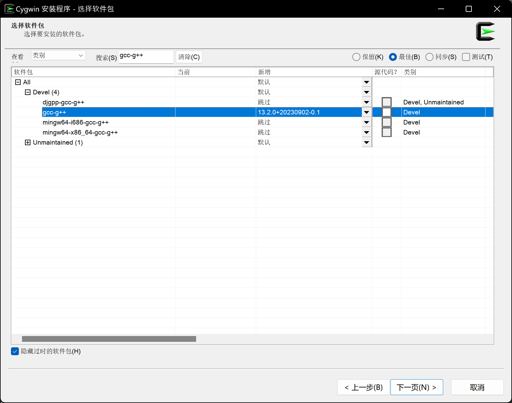
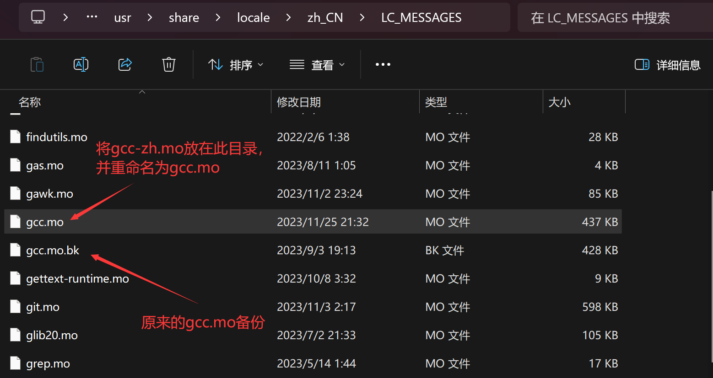

# Kawaii-gcc 让GCC变得可爱

  

让你的GCC编译器变得可爱！

本项目通过修改GCC的输出信息的本地化文件的方式让GCC变得可爱。

欢迎贡献更多有趣的内容。

## 依赖
- GNU GCC
- GNU Gettext

## 如何使用？
### Linux (以Ubuntu为例)

> [中文版使用教程视频-Bilibili](https://www.bilibili.com/video/BV1gC4y1P7t3/)
>
> [日语版使用教程视频-Bilibili](https://www.bilibili.com/video/BV1Wg4y1X74a/)
>
> [日语版使用教程视频-YouTube](https://youtu.be/ASWBU8HhvY0)

- 安装中文 (如果没有安装)

    ```bash
    sudo apt-get install language-pack-zh-hans language-pack-zh-hans-base
    ```

- 安装 `gcc` ,  `gettext` 和 `g++`.

    ```bash
    sudo apt-get install gcc gettext g++
    ```

- 安装 `gcc locales`

    通过以下命令检查你的`gcc`版本号

    ```bash
    gcc -v
    ```

    我这里是12.3.0.所以我的主版本号是12，安装`gcc-12-locales`

    ```bash
    sudo apt-get install gcc-12-locales
    ```

- 找到你的语言文件的路径。默认会在 `/usr/share/locale/zh_CN/LC_MESSAGES/gcc.mo`. 不过你也有可能找不到该文件或者找到名为`gcc-12.mo`的文件。如果已有相关文件，备份之。 (eg. `sudo mv gcc-12.mo gcc-12.mo.bak`) 如果没有相关文件，无需担心，什么都不需要做。

- 通过以下命令下载仓库中的`mo` 文件然后将其复制到刚才的路径去。

    ```bash
     sudo wget https://github.com/Bill-Haku/kawaii-gcc/raw/main/prebuilt/gcc-zh.mo -O /usr/share/locale/zh_CN/LC_MESSAGES/gcc-12.mo
    ```

    您也可以自行重新编译该二进制文件：

    ```bash
    make merge-zh
    msgfmt gcc-zh.po -o gcc.mo
    sudo cp gcc.mo /usr/share/locale/zh_CN/LC_MESSAGES/gcc-12.mo
    ```
    或
    ```bash
    make
    ```

    关于文件名：

    - 如果你在上个步骤找到了相关文件，请直接使用原本的名字。
    - 如果没有，首先使用 `gcc-<主版本号>.mo` 。如果发现不起作用，将其重命名为 `gcc.mo`.

- 修改环境变量以将终端语言改为中文：

    ```bash
    vim ~/.bashrc
    
    # Add the following lines
    export LANG="zh_CN.UTF-8"
    export LANGUAGE="zh_CN.UTF-8"
    # Save it in Vim

    source ~/.bashrc
    ```

- 现在你的GCC已经变得可爱了。

    你可以使用附带的 `test.cc` 来试试效果。

    ```bash
    gcc test.cc -Wall
    # -Wall 表示让GCC输出所有警告信息
    ```

### Windows

1. 安装 [Cygwin](https://www.cygwin.com/)。  
   步骤：
    1. 下载并运行 [setup-x86_64.exe](https://www.cygwin.com/setup-x86_64.exe)
    2. 在 `选择下载源` (`Choose A Download Source`) 步骤时选择 `从互联网安装` (`Install from Internet`)  
    
    3. 在 `选择软件包` (`Select Packages`) 步骤时, 将`查看` (`View`) 设为 `类别` (`Category`) 并依次搜索 (Search) 并选择 ALL/Devel 下的 `gcc-core`，`gcc-g++` 和 `gettext` 的版本
    

2. 假设你的 Cygwin 安装目录 (注意不是软件包下载目录) 为 `<DIR>` (默认应该是 `C:\cygwin`), 将目录 `<DIR>\bin` 目录添加到环境变量 `Path` 中 (如果 `Path` 中已经有 mingw 了, 请删除或者移到`<DIR>\bin`的下方), 并额外增加一条环境变量 `LANG`, 设置为 `zh_CN.UTF-8`

3. 将本仓库的 `prebuilt` 目录下的 `gcc-zh.mo` 放到 `<DIR>\usr\share\locale\zh_CN\LC_MESSAGES` 目录下, 并将其重命名为 `gcc.mo` (建议先将原来的gcc.mo备份)  
    

### macOS

暂未实现。欢迎贡献。

## 如何修改/贡献

前往`./src`目录，使用文本编辑器打开并编辑`zh-kawaii.po`。可以修改已有的内容，也可以根据原始简体中文本地化文件增加新内容。编辑完成后运行`make`指令合并文件，并将其编译成`mo`文件后拷贝到指定的地方。

#### 关于`src`目录下的文件

- `zh_CN.po`: GNU提供的原始简体中文版本地化文件。
- `zh_kawaii.po`: 本项目已修改的本地化内容。

#### 如果您愿意参与贡献本项目

请在PR时将您修改完成的编译好的`mo`文件放在`../prebuilt`目录下，以更新预编译好的本地化二进制文件。

## Star History


## 特别鸣谢

本项目的灵感来自[`gcc-hentai`](https://github.com/Mosklia/gcc-hentai)项目。为了将其推广到日语区，我创建了本仓库、制作了日语版并修改完善了使用说明的诸多细节，最后制作了完全日语的宣传视频发布在YouTube，不料却在Bilibili获得了关注。十分感谢原作者的分享和开源精神。
